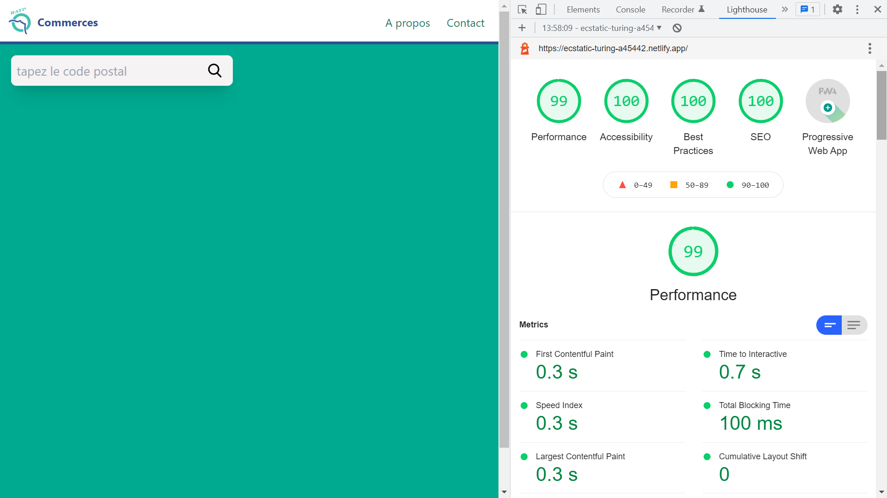
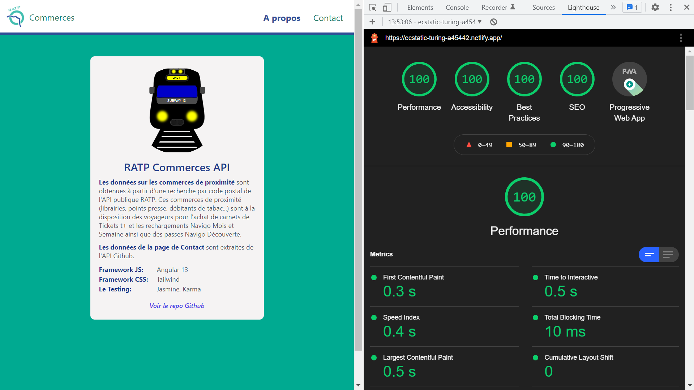
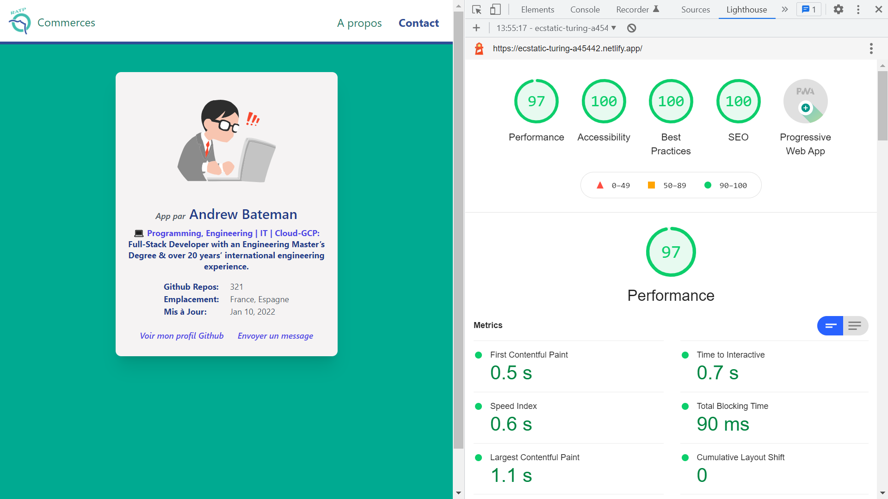
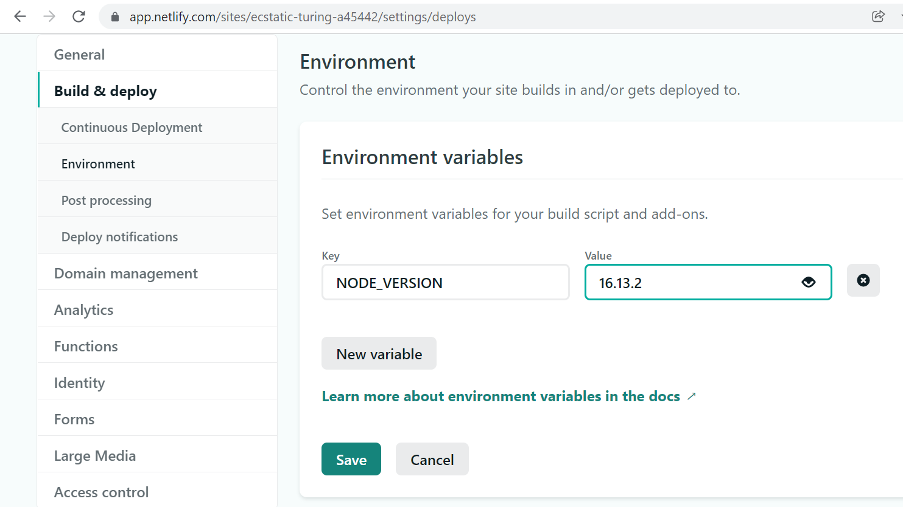

# :zap: Angular PWA SSR

* Angular used to display data from an API with Server Side Rendering as a Progressive Web App.[Deployed to Netlify](https://ecstatic-turing-a45442.netlify.app/).
* **Note:** to open web links in a new window use: _ctrl+click on link_


## :page_facing_up: Table of contents

* [:zap: Angular PWA SSR](#zap-angular-pwa-ssr)
  * [:page\_facing\_up: Table of contents](#page_facing_up-table-of-contents)
  * [:books: General info](#books-general-info)
  * [:camera: Screenshots](#camera-screenshots)
  * [:signal\_strength: Technologies](#signal_strength-technologies)
  * [:floppy\_disk: Setup](#floppy_disk-setup)
  * [:wrench: Testing](#wrench-testing)
  * [:computer: Code Examples](#computer-code-examples)
  * [:cool: Features](#cool-features)
  * [:clipboard: Status, Testing \& To-Do List](#clipboard-status-testing--to-do-list)
  * [:clap: Inspiration/General Tools](#clap-inspirationgeneral-tools)
  * [:file\_folder: License](#file_folder-license)
  * [:envelope: Contact](#envelope-contact)

## :books: General info

* User can enter a post code to search for all commercial enterprises around the RATP station in that post code
* Data comes from the RATP API
* Using Angular Server Side Rendering (ngUniversal) and Service Workers for a Progressive Web App
* Includes Transloco i18n translation json files so user can switch languages from nav buttons
* Deployed from Github so each Commit causes an auto-deploy in Netlify. Netlify performs the build process.

* **Important note:** I had to specify Node version in Netlify in `site-name/settings/deploys/Environment/Environment variables/` `key - value` `NODE_VERSION - 16.13.2` or deploy would fail - see image below

## :camera: Screenshots






## :signal_strength: Technologies

* [Angular framework v16](https://angular.io/)
* [Angular Universal v16](https://angular.io/guide/universal) Server-Side Rendering(SSR) by a Node Express web server
* [Angular Express Engine v16](https://www.npmjs.com/package/@nguniversal/express-engine) for running Angular Apps on the server for server side rendering
* [Tailwind CSS v3](https://tailwindcss.com/)
* [Transloco v4](https://ngneat.github.io/transloco/) used for i18n translations
* [Google Chrome Lighthouse](https://developers.google.com/web/tools/lighthouse) to check quality of website
* [SSR Cookie Service v16](https://www.npmjs.com/package/ngx-cookie-service) to read, set and delete browser cookies

## :floppy_disk: Setup

* Install dependencies using `npm i`
* Run `npm outdated` to see if any dependencies are outdated.
* Run `ng serve` for a non-SSR dev server. Frontend will open at `http://localhost:4200/` - refreshes on code changes
* Run `npm run dev:ssr` for an SSR dev server.
* Run `npm run build` to generate a build file without SSR
* Run `npm run build:ssr` to generate a build file with SSR. Add `defer` to browser CSS file ref.
* Run `npm run serve:ssr` to see on a dev server `http://localhost:4000`
* Run `npm run prerender` to prerender SSR app

## :wrench: Testing

* Run `ng test` to run Jasmine unit tests via [Karma](https://karma-runner.github.io) - passes 2/6 tests

## :computer: Code Examples

* function to serve browser content using SSR - code from ngUniversal

```typescript
// The Express app is exported so that it can be used by serverless Functions.
export function app(): express.Express {
  const server = express();
  const distFolder = join(process.cwd(), 'dist/angular-pwa-ssr/browser');
  const indexHtml = existsSync(join(distFolder, 'index.original.html')) ? 'index.original.html' : 'index';

  server.engine('html', ngExpressEngine({
    bootstrap: AppServerModule,
  }));

  server.set('view engine', 'html');
  server.set('views', distFolder);

  server.get('*.*', express.static(distFolder, {
    maxAge: '1y'
  }));

  server.get('*', (req, res) => {
    res.render(indexHtml, { req, providers: [{ provide: APP_BASE_HREF, useValue: req.baseUrl }] });
  });

  return server;
}
```

## :cool: Features

* Dummy `Robots.txt` & `sitemap.xml` documents added to improve Lighthouse score
* Lighthouse scores: 97 - 99%

## :clipboard: Status, Testing & To-Do List

* Status: Working PWR & SSR app deployed to Netlify. Lighthouse score > 97% for all pages
* Testing: 6/6 tests pass
* To-Do: Add tests, add eslint

## :clap: Inspiration/General Tools

* [RATP API: Commerces de proximité agréés RATP](https://dataratp2.opendatasoft.com/explore/dataset/commerces-de-proximite-agrees-ratp/information/)
* [StackOverflow: Property has no initializer and is not definitely assigned in the constructor](https://stackoverflow.com/questions/64874221/property-has-no-initializer-and-is-not-definitely-assigned-in-the-constructor) includes useful summary of how to avoid errors with initializers
* [Code Shots with Profanis: Discover How to Unit Test Angular Components with RouterTestingHarness](https://www.youtube.com/watch?v=RG5iN783rAY)

## :file_folder: License

* This project is licensed under the terms of the MIT license.

## :envelope: Contact

* Repo created by [ABateman](https://github.com/AndrewJBateman), email: `gomezbateman@yahoo.com`
