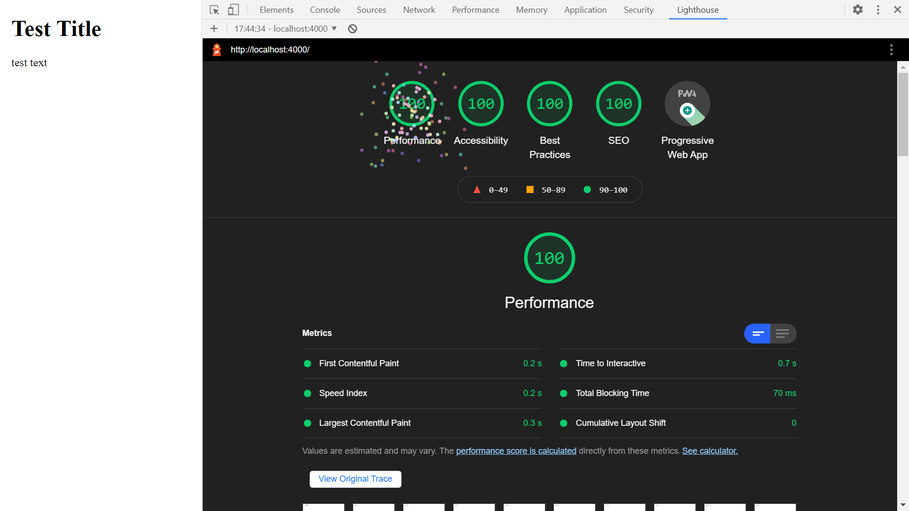

# :zap: Angular PWA SSR

* Angular PWA SSR sandbox to get Server Side Rendering working with a Progressive Web App an then deploy.
* **Note:** to open web links in a new window use: _ctrl+click on link_


## :page_facing_up: Table of contents

* [General info](#general-info)
* [Screenshots](#screenshots)
* [Technologies](#technologies)
* [Setup](#setup)
* [Features](#features)
* [Status](#status)
* [Inspiration](#inspiration)
* [Contact](#contact)

## :books: General info

* Using Angular Server Side Rendering (ngUniversal) and Service Workers for a Progressive Web App
* Node v14, npm v7, @angular/cli v12 & @angular/core v12 installed globally

## :camera: Screenshots



## :signal_strength: Technologies

* [Angular framework v12](https://angular.io/)
* [Angular Universal v12](https://angular.io/guide/universal) Server-Side Rendering(SSR) by a Node Express web server
* [Angular Express Engine v12](https://www.npmjs.com/package/@nguniversal/express-engine) for running Angular Apps on the server for server side rendering
* [Google Chrome Lighthouse](https://developers.google.com/web/tools/lighthouse) to check quality of website

## :floppy_disk: Setup

* Install dependencies using `npm i`
* Run `npm outdated` to see if any npm dependencies are outdated.
* Run `ng serve` for a non-SSR dev server. Frontend will open at `http://localhost:4200/` - refreshes on code changes
* Run `npm run dev:ssr` for an SSR dev server. Frontend will open at `http://localhost:4200/` - refreshes on code changes
* Run `npm run lint` to lint test entire client-side codebase using TSLint.
* Run `npm run build` to generate a build file without SSR
* Run `npm run build:ssr` to generate a build file with SSR. Add `defer` to browser css file ref.
* Run `npm run serve:ssr` to see on a dev server `http://localhost:4000`
* Run `npm run prerender` to prerender SSR app

## :wrench: Testing

* Run `ng test` to run Jasmine unit tests via [Karma](https://karma-runner.github.io)
* Run `ng e2e` to execute the end-to-end tests via [Protractor](http://www.protractortest.org/).

## :computer: Code Examples

* function to serve browser content using SSR - code from ngUniversal

```typescript
// The Express app is exported so that it can be used by serverless Functions.
export function app(): express.Express {
  const server = express();
  const distFolder = join(process.cwd(), 'dist/angular-pwa-ssr/browser');
  const indexHtml = existsSync(join(distFolder, 'index.original.html')) ? 'index.original.html' : 'index';

  server.engine('html', ngExpressEngine({
    bootstrap: AppServerModule,
  }));

  server.set('view engine', 'html');
  server.set('views', distFolder);

  server.get('*.*', express.static(distFolder, {
    maxAge: '1y'
  }));

  server.get('*', (req, res) => {
    res.render(indexHtml, { req, providers: [{ provide: APP_BASE_HREF, useValue: req.baseUrl }] });
  });

  return server;
}

```

## :cool: Features

* Dummy `Robots.txt` & `sitemap.xml` documents added to get perfect Lighthouse score

## :clipboard: Status, Testing & To-Do List

* Status: Working basic SSR app with PWA. 100% perfect Lighthouse score - 16 may 2021
* Testing: not tested yet
* To-Do: add deployment, add content.  `Robots.txt` & `sitemap.xml` files will need updating with correct data

## :clap: Inspiration/General Tools

* Google

## :file_folder: License

* This project is licensed under the terms of the MIT license.

## :envelope: Contact

* Repo created by [ABateman](https://github.com/AndrewJBateman), email: gomezbateman@yahoo.com
